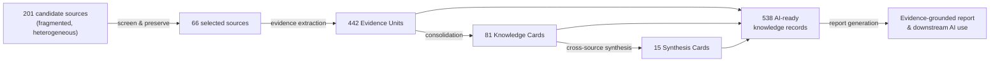

# Reservoir Knowledge Base Agentic Workflow

**A preliminary demo of AI-ready reservoir-operation knowledge**, built to
support an NSF proposal on heterogeneous reservoir-operation data
infrastructure for AI. It shows one working piece of that infrastructure end
to end: turning fragmented, human-written reservoir-operation documents into
structured, provenance-aware, traceable knowledge records that an AI system
can retrieve, reason over, and cite.

## Why this matters

Reservoir-operation information relevant to AI-driven research and
scientific discovery is scattered across operating policies, Records of
Decision, environmental impact statements, technical reports, peer-reviewed
research, government datasets, and public/stakeholder sources. Each source
uses its own vocabulary, its own level of precision, and its own notion of
what counts as a "rule" versus a "target" versus an "observation." Raw text
extracted from these documents is hard for AI systems to use reliably: a
language model reading a PDF chunk has no structured way to know which
numbers are binding rules, which are projections, which are contested, or
which source and section a claim actually came from.

This project's premise is that useful **AI-ready reservoir-operation data**
needs more than better text chunking. It needs records that preserve
*operational meaning* (what kind of fact this is), *provenance* (which source,
which passage), and *evidence relationships and confidence* (how this fact
relates to and is supported by other facts) — so that retrieval, synthesis,
and reasoning over it stay traceable back to evidence, and so uncertainty is
carried forward instead of silently dropped.

The story this repository demonstrates:

```text
fragmented reservoir-operation information (policies, reports, EIS
documents, research papers, datasets, public sources)
        |
        v
structured, provenance-aware, AI-ready knowledge records
        |
        v
retrieval, synthesis, and reasoning by AI
        |
        v
traceable evidence and uncertainty in the final answer
```


**Figure 1. Agentic construction of an evidence-traceable reservoir-operation
knowledge base.** *(a)* Reservoir-operation evidence is distributed across
official operating materials, technical research, data documentation, and
public-context sources. *(b)* An agent coordinates six construction stages
while deterministic tools preserve source files, parse text, validate
records, and maintain stage artifacts. *(c)* The resulting Evidence Units
(EUs), Knowledge Cards (KCs), and Synthesis Cards remain distinct and retain
paths back to the preserved source evidence; indexing prepares validated
records for downstream AI retrieval and reasoning, shown here as the
NSF-scale target use case rather than a capability already benchmarked in
this repository.

## What this demo shows: the Lake Powell case

The primary, featured demo is one complete run of the workflow against Lake
Powell / Glen Canyon Dam (Bureau of Reclamation reservoir ID 144), run date
2026-07-29:
[`runs/lake_powell_20260729_kb/`](runs/lake_powell_20260729_kb/). The
validated outputs are also packaged for direct use in
[`datasets/lake_powell_demo/`](datasets/lake_powell_demo/).

| Quantity | Count |
|---|---:|
| Candidate sources screened | 201 |
| Sources selected and preserved | 66 |
| Evidence Units (EUs) | 442 |
| Knowledge Cards (KCs) | 81 |
| Synthesis Cards (SCs) | 15 |
| Encoded / AI-ready knowledge records | 538 |
| Report claims (all cited to evidence) | 30 |



This run is validated (schema conformance and traceability integrity pass
for every stage; see
[`runs/lake_powell_20260729_kb/validation/`](runs/lake_powell_20260729_kb/validation/))
and is the run this README's numbers, examples, and dataset package are drawn
from. Several earlier Lake Powell runs also exist in
[`runs/`](runs/) (`lake_powell_20260625`, `lake_powell_20260626`,
`lake_powell_20260701`, `lake_powell_20260711`, `lake_powell_20260728`,
`lake_powell_20260729`, and two `_smoke_` test runs). Those are kept for
development history and are **not** the featured demo; they used earlier,
now-superseded conventions and should not be read as equivalent, current
results.

## Evidence Unit, Knowledge Card, Synthesis Card

A first-time reader should not need to open a schema file to understand these
terms.

- **Evidence Unit (EU)** — a source-grounded atomic record representing one
  operational fact, rule, constraint, observation, or relationship. It cites
  exactly one source document, a short verbatim quote, and a source location
  (e.g., a section or table), and is tagged with a confidence level.
- **Knowledge Card (KC)** — a consolidated representation that groups
  related and consistent Evidence Units answering the same operational
  question, while preserving provenance, conditions, and uncertainty. A
  Knowledge Card is not new evidence; it cites every EU it draws on and
  records whether the underlying EUs are a repeated fact, complementary
  facts, or contested/unresolved.
- **Synthesis Card (SC)** — a higher-level, cross-source finding or
  relationship, such as an operational tradeoff, a recurring pattern, a
  regime change, a discrepancy between sources, or an evidence gap. It cites
  the EUs and, where useful, Knowledge Cards behind it.

### How this differs from ordinary RAG text chunks

A typical retrieval-augmented-generation (RAG) pipeline splits documents into
arbitrary, fixed-size text chunks with no explicit notion of what kind of
claim is in the chunk, how it relates to other chunks, or how confident the
system should be in it. Evidence Units, Knowledge Cards, and Synthesis Cards
are different in kind, not just in format: each record preserves *operational
meaning* (an explicit engineering dimension, such as Operation Rules or
Emergency Operations), *provenance* (source ID, quote, location), *evidence
relationships* (which EUs/KCs a higher-level record is built from), and
*confidence/uncertainty* (including cases deliberately left unresolved — see
[Evidence gaps and uncertainty](#evidence-gaps-and-uncertainty-as-a-feature)
below). A RAG chunk answers "what text is near this query"; these records are
built to answer "what is known, on what evidence, with what confidence, and
where did it come from."

## Example: From Source Document to AI-Usable Knowledge

This traces one real chain from the July 29 Lake Powell run, start to finish,
using actual record IDs.

**Question:** What are the minimum and maximum release limits under Modified
Low Fluctuating Flow (MLFF) at Glen Canyon Dam? *(This is retrieval-benchmark
question `IDX-QR-LP-004`; see [`validation/nsf_demo_benchmark.md`](validation/nsf_demo_benchmark.md).)*

| Step | Record(s) | Content |
|---|---|---|
| 1. Source documents | `OFF-008` — *Record of Decision: Operation of Glen Canyon Dam* (1996, usbr.gov); `OFF-005` — *Glen Canyon Dam LTEMP Final EIS, Vol. 1, Ch. 3* (2016) | Preserved PDFs + extracted text under `01_source_acquisition/sources/` |
| 2. Evidence Units | `EU-LP-OFF-008-04` | *"Daily fluctuation limit of 5,000 cfs for monthly release volumes less than 600,000 acre-feet; 6,000 cfs for 600,000-800,000 acre-feet; and 8,000 cfs for monthly volumes over 800,000 acre-feet."* (Table 1 footnote 6) |
| | `EU-LP-OFF-005-03` | *"...release rates ... 8,000 cfs or greater between the hours of 7 a.m. and 7 p.m., and at least 5,000 cfs at night... maximum hourly increase ... 4,000 cfs/hr, and ... maximum hourly decrease ... 1,500 cfs/hr."* (Section 3.13.1.3) |
| 3. Knowledge Card | `KC-LP-OPR-01` — *"MLFF Baseline Operating Limits"* | Consolidates 11 EUs across 8 independent sources (the 1996 ROD, a 2002 report to Congress, a 1997 GAO review, a 2007 biological assessment, a 2008 biological opinion, LTEMP EIS Chapters 1 and 3, and a USGS research paper) into one confirmed statement: minimum release 8,000 cfs (day) / 5,000 cfs (night), maximum 25,000 cfs, up-ramp ≤ 4,000 cfs/hr, down-ramp ≤ 1,500 cfs/hr, and a 3-tier daily-fluctuation cap. |
| 4. Synthesis Card | `SC-LP-004` — *"Safety, sediment, and power-flexibility constraints jointly define the MLFF/LTEMP hourly-release envelope"* | Cross-source analysis showing how this 1996 baseline was later revised by the 2016 LTEMP ROD specifically to reduce sandbar erosion, while WAPA's discretionary hourly dispatch operates inside these limits without requiring a new ROD/EIS. |
| 5. Report claim / answer | `CLM-007` (report §3, `06_report_generation/lake_powell_case_study_report.md`) | *"MLFF set a minimum release of 8,000 cfs (day) / 5,000 cfs (night), a maximum of 25,000 cfs, and ramp-rate and tiered daily-fluctuation limits topping out at 8,000 cfs/day."* — cited to `KC-LP-OPR-01` and `SC-LP-004`, listed with `support_level: synthesis_card_support` in `claim_evidence_map.jsonl`. |

Every arrow in that chain is a real, resolvable ID in
[`datasets/lake_powell_demo/`](datasets/lake_powell_demo/) — nothing in this
example is invented for illustration.

## AI use and evaluation

Knowledge-base construction is demonstrated above. What is **not** yet
demonstrated is that this structured representation improves downstream AI
performance — that is the next step, not a completed result.

The planned evaluation compares three conditions on the same reservoir
questions:

- **A. LLM only** — no retrieval, model answers from parametric knowledge.
- **B. Raw-document RAG** — retrieval over chunked raw source text (the
  preserved PDFs/text in `01_source_acquisition/`).
- **C. Structured knowledge-base retrieval/reasoning** — retrieval and
  reasoning over the Evidence Unit / Knowledge Card / Synthesis Card records
  in `datasets/lake_powell_demo/`.

Candidate evaluation dimensions: answer correctness, evidence recall,
citation accuracy, rate of unsupported claims/hallucination, quality of
cross-document synthesis, provenance traceability, and uncertainty
awareness.

**No results exist yet for this comparison.** This section is an evaluation
plan / preliminary benchmark direction, not a claim that the structured
representation already outperforms raw-document RAG or an LLM alone.

### Preliminary retrieval benchmark (8 questions)

The one piece of this evaluation that does exist is a small, hand-curated
retrieval benchmark from the July 29 indexing stage: **8 manually defined,
single-fact retrieval questions**, each with gold record IDs and expected
answer points fixed *before* retrieval was run. The retrieval method
exercised against them so far is a **deterministic lexical token-overlap
baseline** — not an embedding model, not a production RAG system. At top-10
depth it achieves 66.7% mean recall and 15.0% mean precision on this
8-question set. See [`validation/nsf_demo_benchmark.md`](validation/nsf_demo_benchmark.md)
for the full question list and an explicit statement of what this baseline
does and does not show.

## Evidence gaps and uncertainty as a feature

The workflow deliberately records what is *not* cleanly known, rather than
smoothing it over. This dataset represents missing, weak, and conflicting
evidence alongside confirmed facts, which matters for trustworthy AI and
scientific use — a system trained or evaluated only on confident, resolved
claims will not know how to represent or communicate genuine uncertainty.

Concretely, in the July 29 Lake Powell run:

- 4 of the 81 Knowledge Cards are explicitly typed `contested_or_unresolved`.
  For example, `KC-LP-EMR-05` preserves two different official sources'
  acre-foot totals for the same 2021-2022 drought-response releases (180,000
  AF vs. 161,000 AF for 2021; a 0.50 maf transfer vs. a 350,000 AF release
  readjustment for 2022) side by side, without picking a winner, because
  neither source alone resolves the discrepancy.
- Synthesis Cards carry an explicit `uncertainty_or_exception` field;
  `SC-LP-004` (the worked example above) documents that it could not verify
  from the available evidence whether the LTEMP fluctuation formula can
  exceed the legacy 8,000 cfs/day cap in very high-release months.
- Source acquisition itself preserves 42 documented, non-blocking
  acquisition issues (e.g., a source recovered only via web archive, or with
  degraded text quality) rather than silently dropping affected sources.

## From this demo to the NSF dataset

This repository currently demonstrates the **textual knowledge component**
only: structured records built from documents. The proposed NSF-scale
dataset is broader than a document knowledge base. It would connect:

- textual operational knowledge (what this demo produces),
- observed reservoir time series,
- reservoir metadata,
- provenance / source attribution, and
- uncertainty / evidence quality

into a single AI-usable resource, to support AI retrieval, AI reasoning,
model development, cross-reservoir comparison, scientific hypothesis
generation, and reservoir-operation scientific discovery more broadly. This
repository does not currently integrate reservoir time-series data; that
integration is future NSF-scale work, not a current capability. The
long-term goal is not a bigger document knowledge base — it is
**heterogeneous reservoir-operation data infrastructure for AI**, of which
this textual-knowledge workflow is one demonstrated component.

---

The rest of this README covers how the workflow is built and run.

## Project Structure

| Folder | Purpose |
|---|---|
| `docs/` | Framework paper/proposal and design notes, including the Figure 1 source assets under `docs/AGU/` |
| `skills/` | Agent-usable protocols for the six workflow stages |
| `schemas/` | Machine-readable schemas and controlled vocabularies |
| `templates/` | Reusable templates for runs, manifests, human review, and validation |
| `runs/` | Per-reservoir workflow runs; generated outputs should go here |
| `datasets/` | Curated dataset releases assembled from validated runs (see `datasets/lake_powell_demo/` for the featured demo dataset) |
| `validation/` | Reusable validation tooling and optional method/transfer-study assets |

The canonical routine validation design is documented in
[`docs/validation-framework.md`](docs/validation-framework.md). Reusable
cross-run tooling and optional study assets are described in
[`validation/README.md`](validation/README.md).

## Setup

Create a local virtual environment and install the pinned dependencies before
running any stage script (PDF text extraction silently degrades without
`pypdf`/`cryptography`):

```powershell
python -m venv .venv
.venv\Scripts\python.exe -m pip install -r requirements.txt
```

## Main Workflow

The intended workflow is:

```text
source acquisition
-> evidence extraction
-> knowledge consolidation
-> synthesis
-> indexing
-> report generation
```

## Skill Groups

The workflow uses six stage-specific skill groups:

| Stage | Skill | Role |
|---|---|---|
| 1. Source acquisition | `skills/source-acquisition/` | Discover, screen, preserve, parse, and validate source inventories |
| 2. Evidence extraction | `skills/evidence-extraction/` | Extract source-grounded Evidence Units from parsed sources |
| 3. Knowledge consolidation | `skills/knowledge-consolidation/` | Consolidate related Evidence Units into Knowledge Cards |
| 4. Synthesis | `skills/synthesis/` | Produce Synthesis Cards from validated Evidence Units and Knowledge Cards |
| 5. Indexing | `skills/indexing/` | Encode validated knowledge-base records into index-ready records |
| 6. Report generation | `skills/report-generation/` | Generate evidence-grounded reports and claim-evidence maps |

## Source Tiers

- `TR-A`: official or authoritative operating evidence.
- `TR-B`: research or technical analysis.
- `TR-C`: media, stakeholder, public, or context evidence.

Source inclusion should be based on operational relevance and expected information value, not a fixed target count. Highly documented reservoirs may justify larger source inventories; smaller reservoirs may have only 10-20 high-value sources.

## Implementation Strategy

This project uses a hybrid implementation:

- Python scripts handle deterministic processing, parsing, validation, and metrics.
- LLM calls support source screening, Evidence extraction, Knowledge consolidation, and Synthesis.
- The agent organizes the overall research process, applies skill protocols, runs automated validation, prepares optional human review, manages iteration, and preserves artifact links.

The goal is not a one-off prompt result. The goal is a repeatable, inspectable, human-reviewable workflow for building reservoir operation knowledge-base datasets.
