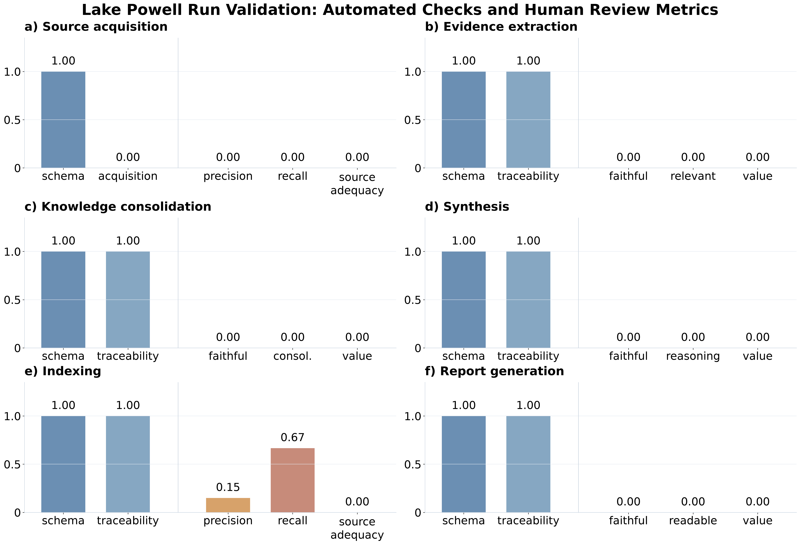

# Validation Report

- Run ID: `lake_powell_20260729_kb`
- Automated validation: **4/6 stages correct**
- Human review completed: **0/6** stages

Figure values are normalized to 0-1: automated pass = 1.00, human 0/1/2 scores are divided by 2, and recall/precision remain ratios.

## Automated validation

| Stage | Schema conformance | Traceability / acquisition | Errors | Warnings |
|---|---|---|---:|---:|
| source acquisition | 66/66 correct | 24/66 correct (42 issues) | 0 | 43 |
| evidence extraction | 442/442 correct | 442/442 correct | 0 | 1 |
| knowledge consolidation | 81/81 correct | 81/81 correct | 0 | 0 |
| synthesis | 15/15 correct | 15/15 correct | 0 | 0 |
| indexing | 538/538 correct | 538/538 correct | 0 | 0 |
| report generation | 30/30 correct | 30/30 correct | 0 | 0 |

## Human review

| Stage | Review completion | Review scope | Human metrics | Main finding |
|---|---|---|---|---|
| source acquisition | incomplete | 0/201 candidates reviewed; 0 selected | precision n/a; recall n/a; source adequacy None/2 | Selected corpus is adequate; 0 unselected candidates were flagged for future consideration. |
| evidence extraction | incomplete | 0/442 items scored | faithfulness n/a; relevance n/a; value n/a | n/a; Mixed sample: revise/reject actions mainly target locators, attribution, front matter, and off-scope EUs. |
| knowledge consolidation | incomplete | 0/81 items scored | faithfulness n/a; consolidation appropriateness n/a; value n/a | n/a; Mostly faithful KCs; several cards need boundary, attribution, or source-quality cleanup. |
| synthesis | incomplete | 0/15 items scored | faithfulness n/a; reasoning soundness n/a; value n/a | n/a; All synthesis cards need revision because they remain EU-only and require source verification before final use. |
| indexing | incomplete | 8/8 benchmark queries completed | recall@k 0.67; precision@k 0.15; source adequacy n/a | Retrieval smoke test is usable but weak; 0 query had inadequate returned evidence. |
| report generation | incomplete | 0/1 items scored | faithfulness n/a; readability n/a; value n/a | n/a; Readable and useful report, but faithfulness needs one claim-evidence repair. |

## Required actions by stage

No human notes or required actions recorded.

## Interpretation

Automated validation establishes file-contract and evidence-chain integrity. Human review evaluates substantive quality. A review is treated as completed when all fields required for that stage are filled, even if `review_status` remains `not_requested`.
